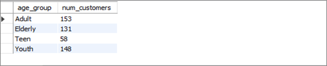
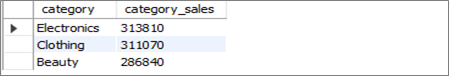
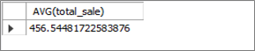
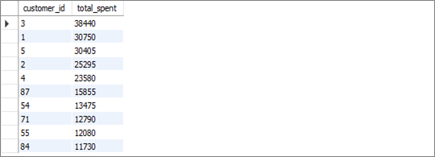
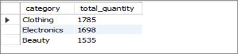
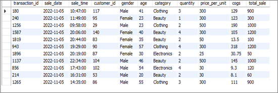
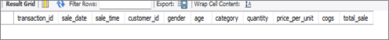
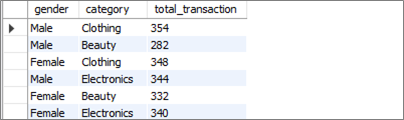

# SQL Retail Sales Analysis Project  

## 📑 Outline  
1. Introduction  
2. Exploratory Analysis  
3. Project Questions and SQL Solutions  
4. Conclusion  
5. Recommendations  

---

## 1.0 Introduction  
This project conducts a detailed analysis of a **Retail Sales Dataset** to derive actionable insights using SQL.  
The dataset contains customer transactions with details such as transaction ID, sale date, customer demographics, product categories, quantity, price per unit, and total sales value.  

Key metrics explored:  
- Gender distribution of customers  
- Customer count per age group  
- Total revenue and revenue by category  
- Average Order Value (AOV)  
- Top 10 customers by sales  
- Top 10 products by sales volume  

Project workflow:  
1. **Database Setup** – Creating and populating a retail sales database  
2. **Data Cleaning** – Removing missing/null records  
3. **Exploratory Data Analysis (EDA)** – Exploring dataset characteristics  
4. **Business Analysis** – Answering business questions with SQL  

Tool used: **MySQL Workbench**  

---

## 2.0 Exploratory Analysis  

### 1. Gender Distribution of Customers  
```sql
SELECT gender, COUNT(customer_id) AS total_customers
FROM customers
GROUP BY gender;
```


### 2. Customer Count per Age Group
```sql
SELECT 
  CASE 
    WHEN age BETWEEN 18 AND 25 THEN '18-25'
    WHEN age BETWEEN 26 AND 35 THEN '26-35'
    WHEN age BETWEEN 36 AND 45 THEN '36-45'
    WHEN age BETWEEN 46 AND 55 THEN '46-55'
    ELSE '56+'
  END AS age_group,
  COUNT(customer_id) AS total_customers
FROM customers
GROUP BY age_group;

```


### 3. Total Revenue
```sql
SELECT SUM(total_sale) AS total_revenue
FROM sales;

```


### 4. Revenue by Category
```sql
SELECT category, SUM(total_sale) AS revenue
FROM sales
GROUP BY category
ORDER BY revenue DESC;

```


### 5. Average Order Value (AOV)
```sql
SELECT AVG(total_sale) AS average_order_value
FROM sales;

```


### 6. Top 10 Customers by Sales
```sql
SELECT customer_id, SUM(total_sale) AS total_spent
FROM sales
GROUP BY customer_id
ORDER BY total_spent DESC
LIMIT 10;

```


### 7. Top Products by Sales Volume
```sql
SELECT product_id, SUM(quantity) AS total_units_sold
FROM sales
GROUP BY product_id
ORDER BY total_units_sold DESC
LIMIT 10;

```



## 3.0 Project Questions and SQL Solutions
### Q1: Retrieve all columns for sales made on '2022-11-05'
```sql
SELECT *
FROM sales
WHERE sale_date = '2022-11-05';
```

### Key Findings: The analysis identified 2022-11-05 as a day with significant sales activity. This provides insight into high-performing days that can be used to evaluate the effectiveness of promotions or seasonal demand.

### Q2: Retrieve transactions where category = 'Clothing' and quantity > 4 in November 2022
```sql
SELECT 
  CASE 
    WHEN age BETWEEN 18 AND 25 THEN '18-25'
    WHEN age BETWEEN 26 AND 35 THEN '26-35'
    WHEN age BETWEEN 36 AND 45 THEN '36-45'
    WHEN age BETWEEN 46 AND 55 THEN '46-55'
    ELSE '56+'
  END AS age_group,
  COUNT(customer_id) AS total_customers
FROM customers
GROUP BY age_group;
```

### Key Findings: The analysis found that there were no transactions in the Clothing category with quantities greater than 4 during November 2022. This indicates that customers generally purchased clothing items in smaller quantities, suggesting that bulk purchase is not common in this category.


### Q3: Calculate total sales for each category
```sql
SELECT category, SUM(total_sale) AS total_sales
FROM sales
GROUP BY category;
```

### Key Findings: The analysis showed that the Clothing category generated the highest total revenue, making it the strongest contributor to overall sales performance.

### Q4: Average age of customers buying 'Beauty' products
```sql
SELECT AVG(age) AS avg_age
FROM customers c
JOIN sales s ON c.customer_id = s.customer_id
WHERE s.category = 'Beauty';
```

### Key Findings: customers purchasing from the Beauty category had an average age of 40 years. This indicates that the Beauty segment appeals most strongly to this age group, providing an opportunity for targeted marketing.

### Q5: Transactions with total sale > 1000
```sql
SELECT *
FROM sales
WHERE total_sale > 1000;
```

### Key Findings: Several transactions exceeded 1000 in total sales value, highlighting the presence of premium buyers. These customers represent a valuable segment that could be targeted with loyalty rewards or exclusive offers.

### Q6: Number of transactions by gender per category
```sql
SELECT c.gender, s.category, COUNT(s.transaction_id) AS total_transactions
FROM sales s
JOIN customers c ON s.customer_id = c.customer_id
GROUP BY c.gender, s.category;
```

### Key findings: The analysis revealed that Female customers made more purchases in Beauty Category while Male customers dominated Clothing and Electronics. This shows clear gender preferences across product categories.


## 4.0 Conclusion
Peak Sales Period: Evening (after 5 PM) = highest activity. Category Performance: Clothing = top revenue + most unique customers. Customer Segmentation: Female → Beauty, Male → Clothing/Electronics. High-Value Customers: Customer ID 3 + premium buyers (>1000 purchases). Seasonality: July 2022 peak month, Nov 5th = strong sales day. Purchase Behavior: Clothing bought in small quantities. Demographics: Beauty buyers averaged 40 years old.

## 5.0 Recommendations

📈 Leverage Evening Demand: Boost promotions & staffing during evenings.

👕 Promote Clothing Category: Strongest revenue contributor.

🎯 Target Gender Preferences: Women → Beauty, Men → Clothing & Electronics

💎 Retain High-Value Customers: Loyalty programs for top buyers.

🗓️ Capitalize on Seasonal Trends: Stock & campaigns ahead of July.

👵 Age-Based Marketing: Beauty campaigns targeting ~40-year-old customers.

🔄 Encourage Repeat Purchases: Focus on repeat incentives vs. bulk offers.
